# 编程手册
1.运行STM32CubeMX，然后点New Project，选芯片，点击所选芯片，然后点右上角Start Project，就会出现如下的界面，下图是全都配置好之后的样子：  
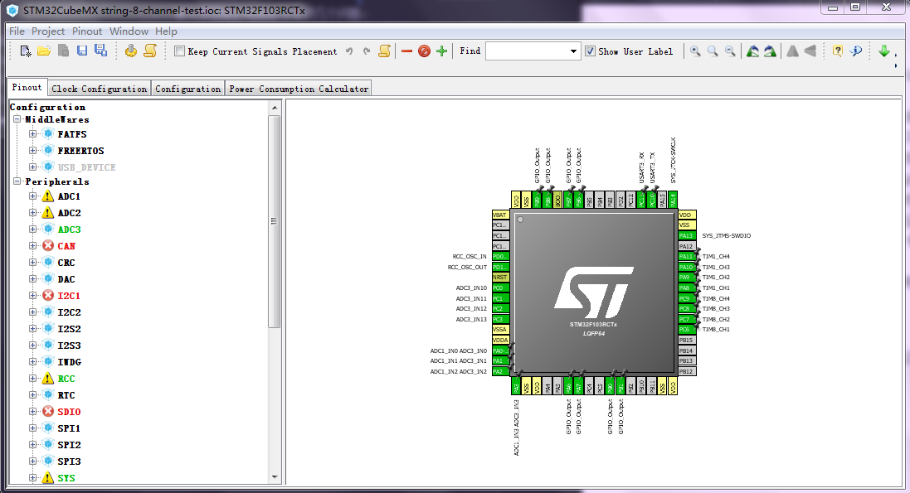  
2.在Pinout列表以及右侧引脚图中配置引脚，可以在右侧引脚图中看到效果，来确定是否和当前板子所用定义一致。
+ 在Pinout中配置RCC，使能HSE，选用外部晶振：  
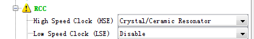  
+ 在Pinout中配置SYS，Debug在本电路中选用Serial Wire。  
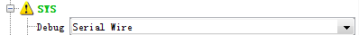  
+ 在Pinout中配置USART3，并在右侧引脚图中选择实际电路所使用的引脚。  
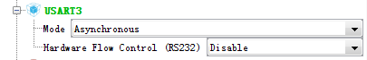  
按上图选了mode之后，右侧引脚图默认的TX和RX是PB10和PB11，需要把他们选到C10和C11上，方法是在C10和C11上单击左键然后选择USART3_TX和USART3_RX。  
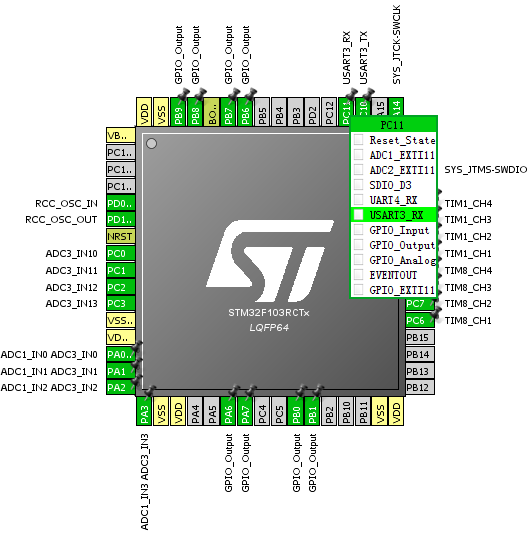  
+ 在Pinout中配置TIM1和TIM8，分别设置Channel1~Channel4为输入捕捉模式，右侧引脚图可看到所使用的对应的输入捕捉的引脚。  
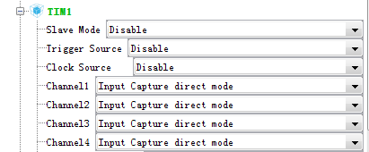  
+ 在Pinout中配置ADC3。  
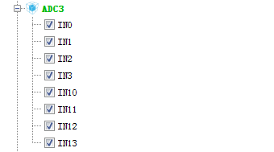  
+ 激频所用的CE引脚则在右边引脚图中直接单击配置成GPIO_Output。
+ 最后再使能一个TIM2定时用，配置它的Clock Source为Internal Clock。  
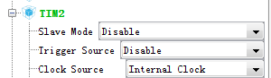  

3.配置时钟树，进入Clock Configuration配置如下：  
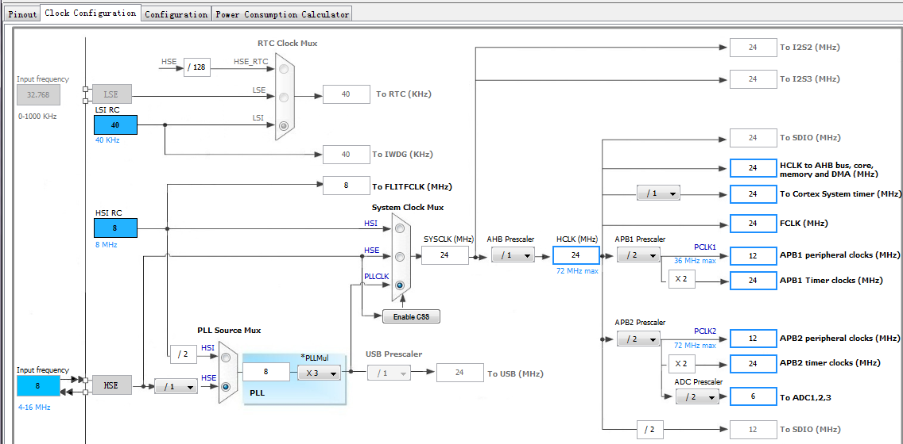  
所用外部晶振为8M，配置系统主频为24M，由STM32F103的数据手册，定时器1和定时器8都是挂在APB2上的。  
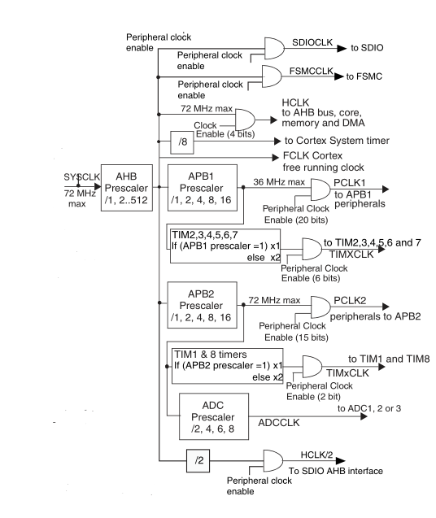  
因此输入捕捉计数的时钟频率就是24M。
4.配置外设参数，进入Configuration配置如下:
+ 配置串口的波特率为9600
+ 输入捕捉所用的定时器TIM1和TIM8，默认配置即可，计数最大值为65535。
+ 配置DMA通道，分别在DMA1和DMA2中选择TIM1和TIM8各4个输入捕捉通道作为发起DMA请求的源，DMA设为单次模式，外设地址不增，内存地址自增，每一个存储单位为半字（16bit）  
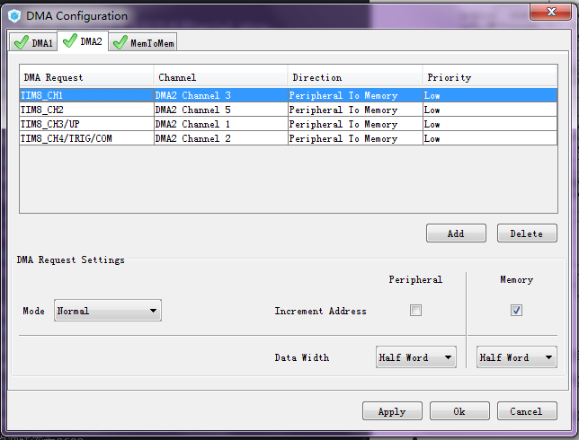  
+ 配置TIM2定时器：  
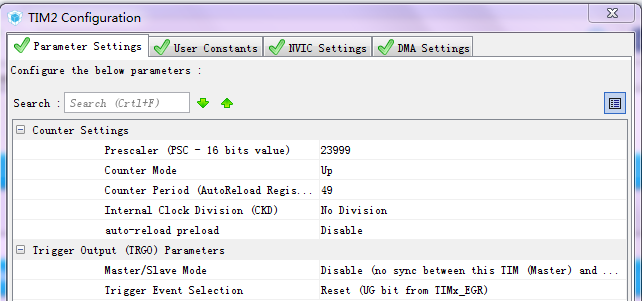  
预分频23999，计数频率为24M/(23999+1)=1kHz，自动重装值为49，在NVIC Settings选项卡中使能TIM2 global interrupt，所以定时中断的周期为(49+1)/1000=50ms。
+ 配置ADC3模数转换器：
因为一共有8个通道需要采集，但是也并不需要时时刻刻都采集，因此选用了扫描模式+单次模式+间断模式这种配置。
扫描模式：要采多个通道
单次模式：每次采完一次就停
间断模式：关键！如果不使能的话就会像狗血的AD7176那样，多通道使能+单次转换的结果就是每次采集所有通道一个接一个的输出一波，然后停止。使能了间断模式再将Number Of Discontinuous Conversion设置成1就可以每采一个通道、输出一下、停止，然后再采一个通道、输出、停（话说如果Number Of Discontinuous Conversion设为2的话就是采两个通道、输出一个再接一个、才停下，所以网上说“否则在获取ad值得时候只能读取到每个间断组最后一个通道”）
而且在STM32CubeMX中，ADC这部分的软件好像有点bug？？必须要按照特定的次序才能选出这个配置：把Number Of Conversion选成8，，然后才能选Scan Conversion Mode，然后选Continuous Conversion Mode，然后选Discontinuous Conversion Mode和Number Of Discontinuous Conversion。  
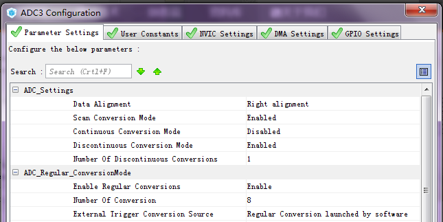  
最后设置一下ADC_Regular_ConversionMode当中的rank，话说这里这个软件也很奇怪，Number Of Conversion选成8之后，rank又多了7栏，不过不用管它，设置前8个即可，采集的时候就会按照rank从1到8顺序采集通道0、1、2、3、10、11、12、13。  
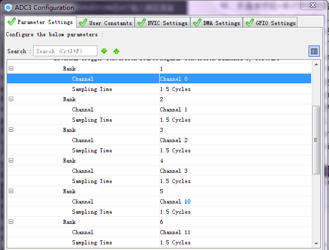  
5.点击菜单栏Project中的Settings，设置Toolchain/IDE，我用的是MDK-ARM V5，再点击Generate Code，就可以生成代码工程了。

最后是在工程中程序的编写：
串口发送：
```c
HAL_UART_Transmit(&huart3,(uint8_t *)data_buf,34,1000);
```
定时中断：
```c
HAL_TIM_Base_Start_IT(&htim2); //初始化中添加
void TIM2_IRQHandler(void) //中断处理函数
```
输入捕捉：
```c
HAL_TIM_IC_Start_DMA(htim[i], TIM_CHANNEL[i], (uint32_t *)Capture[i], size); //每次捕捉之前调用
void HAL_TIM_IC_CaptureCallback(TIM_HandleTypeDef *htim) //main.c中再次定义，在函数中置位自己定义的输入捕捉完成标志，会由下面的HAL_DMA_IRQHandler中的函数调用。
void DMA1_Channel2_IRQHandler(void)
{
  HAL_DMA_IRQHandler(&hdma_tim1_ch1);
  ···
}//中断处理函数，在其中为了区分别的中断源，可以判断之前在HAL_TIM_IC_CaptureCallback中置位的标志位。
```
模数转换：
```c
void get_temperature()
{
	int i;
	for(i = 0;i < 8;i ++)
	{
		HAL_ADC_Start(&hadc3); //每个间断组都需要开启
		HAL_ADC_PollForConversion(&hadc3,1000); //等待转换完成
		adcbuf[i]=HAL_ADC_GetValue(&hadc3); //读取结果
	}
	HAL_ADC_Stop(&hadc3); //一停全停
}
```
